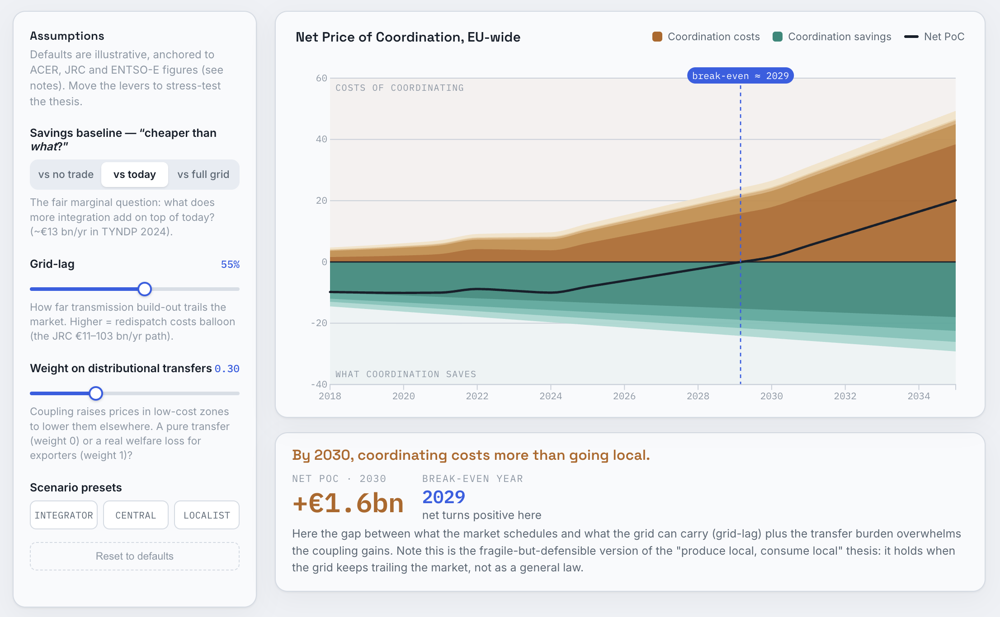

# The Price of Coordination

An interactive D3.js visualization that asks a blunt question about EU electricity markets: **does coupling bidding zones actually pay for itself — and if so, for how much longer?**

The EU's answer to the energy transition is to coordinate electricity across dozens of bidding zones through a single coupled market. That coordination lowers generation costs, but it isn't free: redispatch, interconnector capital, cross-zone transfers, and the growing gap between what the market schedules and what the grid can physically carry. This tool defines a metric — the **Price of Coordination (PoC)** — that nets those costs against what coupling actually saves, and plots it over time so you can see the year the trade flips.



## The metric

```
PoC(t) = [ Redispatch + Interconnector capex + Loop-flows + Coordination overhead + w·Distributional transfer ]
         − [ Dispatch savings + Reserve pooling + Avoided curtailment + Security of supply ]
```

- **PoC > 0** → coordinating cost more than going local that year.
- **PoC < 0** → coordination paid for itself.
- The **break-even year** is where the net line crosses zero under your chosen assumptions.

It's the electricity-market cousin of the *Price of Anarchy* from mechanism design, inverted: instead of "what does decentralization cost us versus the optimum," it measures "what does forcing coordination cost us versus letting zones stand alone."

## What it does

- **Diverging area chart** — coordination costs stack upward, savings stack downward, with a bold net line and an automatic break-even marker.
- **Three levers** that contain the whole argument:
  - **Grid-lag** — how far transmission build-out trails the market. Higher = the redispatch bill balloons along the JRC projection path.
  - **Distributional weight** — whether cross-zone price transfers are a harmless reshuffle (0) or a real loss to exporting regions (1).
  - **Savings baseline** — "cheaper than *what*?": versus no trade at all, versus today's integration, or versus a fully-built grid.
- **Scenario presets** — *Integrator*, *Central*, and *Localist* stack the levers into three defensible worldviews.
- **Hover** any year for the full component-by-component breakdown.

## Data and provenance

The default trajectories are **illustrative and stylised for exploration**, anchored to published figures:

| Component | Anchor | Source |
|---|---|---|
| Congestion management cost | ≈ €4 bn in 2023 (~60% in Germany) | ACER Market Monitoring Report 2024 |
| Redispatch cost ramp | ≈ €11–26 bn/yr by 2030; €34–103 bn/yr by 2040 (historic grid-build rate) | European Commission JRC, 2024 |
| Coupling welfare (vs no trade) | ≈ €34 bn in 2021 | ENTSO-E "zero scenario" |
| Marginal integration welfare | ≈ €6 bn/yr investment → ≈ €13 bn/yr welfare | ENTSO-E TYNDP 2024 |

**Do not cite the default output as fact.** The trajectories are written as plain functions of the year in the `MODEL` section of the script, so you can swap in real series:

- **Redispatch / countertrading volumes and costs** → [ENTSO-E Transparency Platform](https://transparency.entsoe.eu/)
- **Congestion and cross-zonal capacity** → [ACER Market Monitoring Reports](https://www.acer.europa.eu/)
- **Welfare / cost-benefit deltas** → ENTSO-E TYNDP cost-benefit datasets

## Customization

All model logic lives in one `<script>` block near the bottom of the HTML:

- `redispatch()`, `interconnector()`, `dispatch()`, etc. — edit these functions or replace them with lookups into your own data.
- `COSTKEYS` / `BENKEYS` — the component definitions, labels, and colors.
- `DEFAULTS` / `PRESETS` — the starting state and preset scenarios.
- CSS custom properties in `:root` — the full color and type system.

## Caveats and open design questions

This is a framework for structured argument, not a forecast. Two choices a reviewer will reasonably push on:

- **Distributional transfers are transfers, not deadweight loss.** They arguably belong on a separate fairness axis rather than the cost side — hence the adjustable weight.
- **PoC is expressed in €bn, EU-wide.** A €/MWh normalization would make it comparable across zones of very different sizes. (Not yet implemented — a natural next addition.)

## License

Choose one before publishing (e.g. [MIT](https://choosealicense.com/licenses/mit/) for the code). Note that the underlying data figures belong to ACER, ENTSO-E, and the European Commission JRC and are subject to their respective terms.

---

*Built as an exploratory tool for the "produce local, consume local" debate in EU electricity market design. Contributions and better data welcome.*
